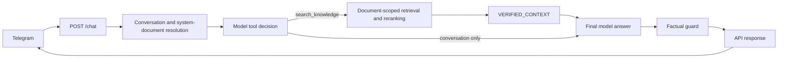

# Admissions RAG Assistant

## Project purpose

A portfolio-scale admissions assistant built with FastAPI, Telegram, SQLite,
Gemini/OpenAI, and multilingual embeddings. It answers ordinary conversation
directly, while factual admissions and organization questions must be grounded in
the administrator-selected knowledge document.

## Main features

- Telegram transport backed by one `POST /chat` API.
- Persistent conversation identity and bounded message history in SQLite.
- One explicit `SYSTEM_DOCUMENT_ID` shared across Telegram conversations.
- Model-managed `search_knowledge` decisions with Gemini native function calling
  and an OpenAI structured fallback.
- Document-scoped semantic, lexical, exact-FAQ, and category-aware reranking.
- Controlled failure for missing knowledge, empty retrieval, and provider errors.
- PDF/TXT upload, validated knowledge-pack import, source metadata, and unanswered-
  question review tools.

## Current architecture and request flow



`POST /chat` validates the request, resolves the Telegram conversation, loads
bounded history, and persists the current message. The model may answer ordinary
conversation directly. Factual questions must invoke `search_knowledge`; retrieval
loads chunks only from the configured document and returns accepted facts as
`VERIFIED_CONTEXT`. The final answer passes through a deterministic factual guard,
is persisted when appropriate, and is returned to Telegram.

## Grounding and fail-closed guarantees

- Mutable business facts—contacts, prices, dates, requirements, guarantees,
  policies, and service details—belong only in knowledge data.
- Normal factual answers require verified retrieved context. Conversation history,
  user claims, and retrieved instructions are not factual authority.
- Empty retrieval cannot produce a successful unsupported answer; it becomes
  `insufficient_document_information` with a canonical deterministic response.
- A missing, invalid, or empty configured system document returns a controlled
  HTTP 503 before retrieval or provider invocation.
- The factual guard removes unsupported concrete numbers, contacts, deadlines, and
  guarantee claims. This reduces risk but is not a proof of perfect hallucination
  prevention.
- Normal answers are generated by the configured LLM. Command text and controlled
  knowledge/provider/system errors are deterministic application messages.

## Actual project structure

```text
src/admissions_rag_assistant/
  app.py                     FastAPI endpoints and startup readiness
  telegram_bot.py            Telegram commands and /chat transport
  conversation_service.py    Conversation and system-document resolution
  rag_service.py             Active model/tool/retrieval/guard orchestration
  llm_answer_generator.py    Gemini/OpenAI conversation provider boundary
  embedding_model.py         Cached embedding-model loading
  embedding_retriever.py     Semantic and lexical candidate scoring
  retrieval_reranker.py      Hybrid/category-aware reranking
  database.py                SQLite schema and repositories
  document_processor.py      PDF/TXT parsing and chunking
  knowledge_*.py             Knowledge validation and atomic import
knowledge/                   Versioned knowledge data and scope notes
scripts/                     Validation, import, audit, export, evaluation, smoke
tests/                       Unit and integration tests and fixtures
pyproject.toml               Setuptools src-layout package metadata
```

## System-document activation

Every upload receives a database document ID and a UUID-based stored filename. The
original filename is retained for display. In production, `SYSTEM_DOCUMENT_ID`
selects one admissions knowledge document for every Telegram conversation. New
conversations receive it automatically. At backend startup, existing conversations
with no document or an older document are synchronized to it transactionally
without changing their messages. Normal requests repair only the current
conversation when necessary. Conversation histories remain separate even though
retrieval uses the same document.

Clients cannot switch documents while system-document mode is configured. A
conflicting `document_id` receives HTTP 409; sending the configured ID is accepted
for compatibility. There is no mutable global “latest document” fallback in this
mode.

To replace the knowledge document, an administrator uploads and validates the new
PDF/TXT, notes its database document ID, changes `SYSTEM_DOCUMENT_ID` to that ID,
and recreates the containers. Startup and the next request synchronize every
conversation to the replacement document. No database deletion or manual
conversation update is required. Uploading alone does not activate a different
system document. The ID is an explicit deployment choice and `.env.example` does
not guess one.

## Knowledge-pack validation and import

Mutable business facts must live in a validated JSON knowledge pack, not Python or
Telegram command text. Validate a pack without changing SQLite:

```shell
python scripts/validate_knowledge_pack.py knowledge/company_demo.json
```

Preview an import (dry-run by default):

```shell
python scripts/import_knowledge_pack.py knowledge/company_demo.json \
  --database admissions.db \
  --document-name company-knowledge \
  --base-document-id "$BASE_DOCUMENT_ID"
```

After reviewing the report, repeat with `--apply`. Production scope is the default;
`--scope demo` deliberately includes approved demo records and should use a separate
demo database/document. See `knowledge/README.md` for scope rules. Set the resulting
document ID as `SYSTEM_DOCUMENT_ID`.

## Upload behavior

Uploads:

- accept `.txt` and `.pdf` only;
- enforce `MAX_UPLOAD_SIZE_MB` while reading bounded chunks;
- check PDF signatures and basic TXT validity;
- reject empty or unreadable/scanned documents;
- persist the document and all chunks in one SQLite transaction;
- never return internal filesystem paths.

## API endpoints

Primary endpoint:

```http
POST /chat
Content-Type: application/json

{
  "question": "А раньше можно?",
  "conversation_id": "optional",
  "external_chat_id": "required",
  "external_user_id": "optional"
}
```

All conversation endpoints are Telegram-only. Requests without
`external_chat_id` return HTTP 400. A saved `conversation_id` is accepted only
when its chat and optional user identifiers match, preventing one Telegram user
from reusing another user's conversation.

`document_id` remains in the request model for backward compatibility. When
`SYSTEM_DOCUMENT_ID` is set, it cannot select any other document.

The response includes `question`, `standalone_question`, `answer`, `status`,
`sources`, `conversation_id`, document metadata, provider, and retrieval/provider
timings. Supported answer statuses are:

- `success`
- `insufficient_document_information`
- `provider_unavailable` for infrastructure/provider failures
- `system_document_unavailable` when the configured knowledge document is missing
  or empty

Other endpoints:

- `GET /` — minimal service identification.
- `GET /health` — cheap process liveness.
- `GET /ready` — database, provider configuration, system document, and chunk
  readiness; no paid LLM call.
- `POST /upload` — administrator PDF/TXT ingestion.
- `POST /conversation/reset` — clears messages and preserves/reapplies the system
  document.
- `GET /conversation/status` — backend and system-document status.

## Telegram commands

- `/start` — introduction.
- `/help` — usage, follow-ups, and reset guidance.
- `/reset` — clear this chat's persisted message history, retaining its document.
- `/status` — check backend reachability and active document filename.

Questions from the same Telegram chat are serialized so replies cannot overtake one
another. Different chats are processed concurrently. Backend/provider text is
escaped before Telegram HTML rendering.

## Unanswered-question review

Questions with no accepted context are recorded without Telegram identity data and
deduplicated for later knowledge review. The exporter is read-only:

```shell
python scripts/export_unanswered_questions.py --status open --clean \
  --sort most-frequent --output unanswered_questions_clean.csv
```

## Environment variables

Copy `.env.example` to `.env` and set credentials. Never commit `.env`.

| Variable | Code default | Purpose |
|---|---:|---|
| `LLM_PROVIDER` | unset | Required: `gemini` or `openai` |
| `GEMINI_API_KEY`, `GEMINI_MODEL` | unset | Required when Gemini is selected |
| `OPENAI_API_KEY`, `OPENAI_MODEL` | unset | Required when OpenAI is selected |
| `TELEGRAM_BOT_TOKEN` | unset | Required for the Telegram process |
| `SYSTEM_DOCUMENT_ID` | unset | Required positive ID selected by the deployer |
| `DATABASE_PATH` | `admissions.db` | SQLite file; Compose overrides it to `/data/admissions.db` |
| `EMBEDDING_MODEL_NAME` | multilingual MiniLM | Sentence-transformers model |
| `CHAT_HISTORY_LIMIT` | `16` | Maximum recent messages supplied to the model |
| `CHAT_HISTORY_CHARACTER_LIMIT` | `4000` | Character cap across supplied history |
| `SEMANTIC_TOP_K` | `5` | Maximum retrieved chunks |
| `SEMANTIC_SCORE_THRESHOLD` | `0.20` | Primary semantic threshold |
| `SEMANTIC_FALLBACK_SCORE_THRESHOLD` | `0.18` | Fallback threshold |
| `SEMANTIC_FALLBACK_SAFE_MINIMUM` | `0.15` | Minimum permitted fallback threshold |
| `CONTEXT_SCORE_MARGIN` | `0.12` | Additional-context score margin |
| `HYBRID_SEMANTIC_CANDIDATE_LIMIT` | `15` | Semantic candidate pool |
| `HYBRID_LEXICAL_CANDIDATE_LIMIT` | `15` | Lexical candidate pool |
| `HYBRID_MAX_CONTEXT_CHUNKS` | `5` | Hybrid context cap |
| `MAX_UPLOAD_SIZE_MB` | `15` | PDF/TXT upload limit |
| `DOCUMENT_CACHE_SIZE` | `8` | In-process document cache size |
| `BACKEND_URL` | `http://127.0.0.1:8000` | Telegram-to-backend URL |
| `BACKEND_CONNECT_TIMEOUT_SECONDS` | `10` | Telegram connection timeout |
| `BACKEND_READ_TIMEOUT_SECONDS` | `90` | Telegram response-read timeout |
| `BACKEND_WRITE_TIMEOUT_SECONDS` | `15` | Telegram request-write timeout |
| `BACKEND_POOL_TIMEOUT_SECONDS` | `10` | Telegram pool timeout |
| `LOG_LEVEL` | `INFO` | Application log level |
| `DEMO_MODE` | `false` | Reports intentional demo scope in health/readiness |
| `RUN_LIVE_LLM_TESTS` | unset | Explicit safety gate for the live smoke script |

The application does not log API keys, Telegram tokens, full histories, complete
documents, authorization headers, or full LLM prompts.

### Retrieval quality controls

Semantic similarity, lexical overlap, exact FAQ matching, and category compatibility
rank candidates, while configured thresholds still control acceptance. Evaluate a
test index without calling an answer provider:

```shell
python scripts/evaluate_retrieval.py --database test.db --document-id "$DOCUMENT_ID" \
  --cases tests/fixtures/retrieval_quality_cases.json
```

Telegram waits up to 90 seconds for the backend response body by default. The
embedding model receives one local warmup encode at backend startup; no LLM call is
made by warmup. `/ready` requires database, embedding, provider configuration, and
an available configured document, while `/health` reports process liveness.

## Docker setup

```shell
docker compose up --build
docker compose logs -f
docker compose down
```

The backend is at <http://localhost:8000> and liveness is at
<http://localhost:8000/health>. There is no public browser UI.

Named volumes persist:

- SQLite at `/data/admissions.db`;
- uploads at `/app/uploads`;
- Hugging Face model cache.

**Do not use `docker compose down -v` unless permanent deletion of the database,
uploads, and model cache is intentional.**

## Local setup

```shell
python -m venv .venv
.\.venv\Scripts\activate
Copy-Item .env.example .env
pip install -r requirements.txt
pip install -e . --no-deps
python -m uvicorn admissions_rag_assistant.app:app --reload
```

On Linux/macOS, activate with `source .venv/bin/activate` and copy the environment
template with `cp .env.example .env`. Select a provider, add its credentials, and
activate a valid system document before expecting `/ready` to return HTTP 200.

Run Telegram separately only when no other deployment is polling with the same
token:

```shell
python -m admissions_rag_assistant.telegram_bot
```

## SQLite persistence and reset

Startup initializes the schema additively; documents, chunks, conversations,
messages, and unanswered questions persist. SQLite uses WAL mode and a 30-second
busy timeout. `/reset` clears one conversation without deleting its document.
Never delete an unknown database path or use `docker compose down -v` unless
permanent removal of persisted demo data is intentional.

## Tests

Tests use temporary databases, temporary upload directories, fake embeddings, and
mocked Gemini/OpenAI/Telegram calls:

```shell
python -m pytest tests/test_chat_integration.py -q
python -m pytest -q
python -m compileall -x ".venv" .
docker compose config --quiet
docker build -t admissions-rag-assistant:local .
```

## Safe live smoke procedure

The live smoke is opt-in because it calls the configured provider. It copies
`DATABASE_PATH` to a temporary directory, resolves only `SYSTEM_DOCUMENT_ID`, fails
before provider use when that document is invalid/missing/empty, and sends two
messages (at most four provider requests):

```shell
RUN_LIVE_LLM_TESTS=1 python scripts/live_conversation_smoke.py
```

PowerShell equivalent:

```powershell
$env:RUN_LIVE_LLM_TESTS = "1"
python scripts/live_conversation_smoke.py
```

Use a private demo database and non-production credentials. The script never
selects the newest document and does not mutate the source database.

## Known limitations

- SQLite is appropriate for this single-instance project; multiple backend replicas
  would require coordinated database/storage design.
- Scanned PDFs require OCR before upload.
- Telegram does not upload or select documents. An administrator manages the
  shared document through the upload API and `SYSTEM_DOCUMENT_ID`.
- A protected document/statistics/review administration panel is not implemented.
- The first embedding operation may download the configured model and take longer.
- Provider availability and response quality depend on the selected external model.
- The prompt requests the current-message language, but multilingual accuracy is
  model-dependent and is not guaranteed.

## Future improvements

- Add authenticated document and unanswered-question administration.
- Add OCR ingestion for scanned PDFs.
- Add repeatable provider evaluation datasets and deployment observability.
